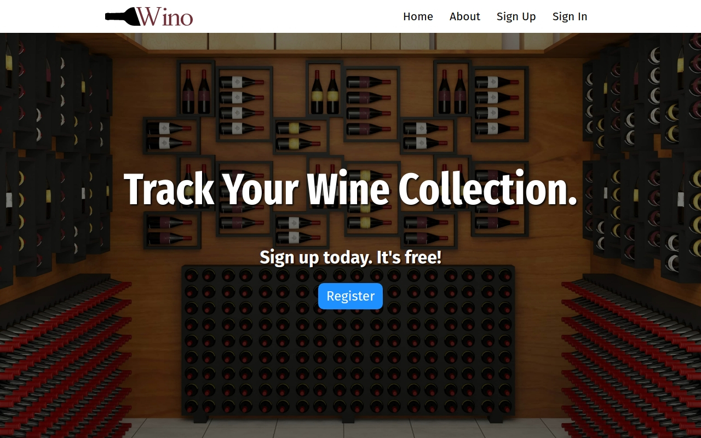

# Wino


A wine cellar management app that lets you track your collection and see its values as well as keep tasting notes and food pairing suggestions.
## Under the Hood
This web app was made using Visual Studio Code in a Linux environment.
## To Set Up Locally
You can take all the files of this site and run them on your computer as if it were live online, only it's just on your machine. This project uses the [Snooth](http://www.snooth.com) API to retrieve data about wines based on user searches.
### Requirements
* [Git](http://git-scm.com/)
* [Node.js](https://nodejs.org/en/)
* [MongoDB](https://www.mongodb.com/)

To copy the repository's files from here onto your computer and to view and serve those files locally, at your computer's command line type:
```
git clone https://github.com/matthew-conrad/wino.git
```
Open the files in a text editor such as [Visual Studio Code](https://code.visualstudio.com/) and, if you have access to [Bash](https://en.wikipedia.org/wiki/Bash_(Unix_shell)), in the terminal type:
```bash
npm install
```
to install all of the required dependencies. Then, in the terminal, type:
```bash
npm start
```